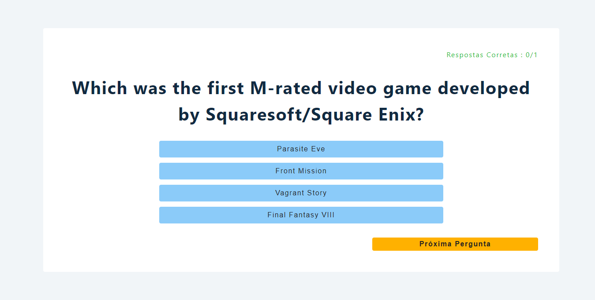

# Quizzo - Questionário Dinâmico

## Descrição

Quizzo é um projeto em que o usuário customiza seu próprio quiz. Tem diversos níveis de dificuldade, diferentes temas e perguntas sortidas.

## Detalhes

● Desenvolvi um aplicativo em SPA de quiz utilizando uma API com um banco de dados externos contendo perguntas com diversas categorias diferentes.

● Formulei um mecanismo para criar um quiz personalizado de acordo com as preferências do usuário, possibilitando que ele escolha número de perguntas, nível de dificuldade e tema do quiz.

## Link para acesso

https://quizzo-lovat.vercel.app/

## Prévia

